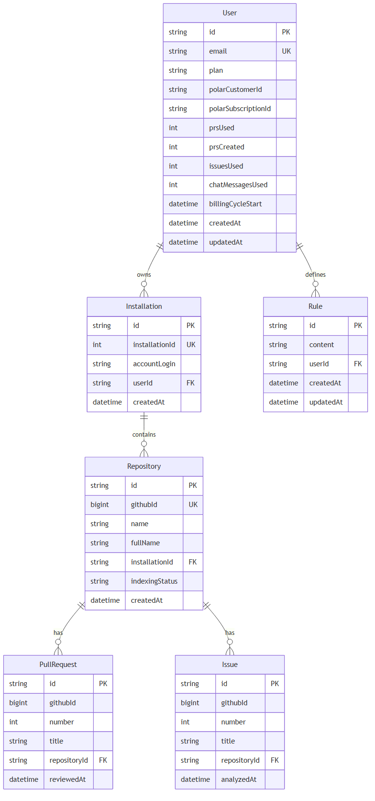
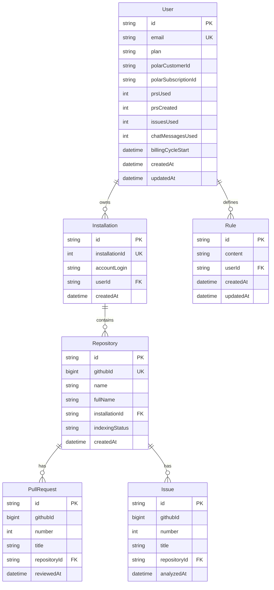

# Database Schema — Relations

Source of truth: [schema.prisma](./schema.prisma). Datasource: PostgreSQL.

## Entity Relationship Diagram (Mermaid)





## ASCII Relationship Map

```
                                 ┌──────────────────────┐
                                 │         User         │
                                 │──────────────────────│
                                 │ id            PK      │
                                 │ email         UK      │
                                 │ plan   (FREE|PRO)     │
                                 │ polarCustomerId?      │
                                 │ polarSubscriptionId?  │
                                 │ prsUsed / prsCreated  │
                                 │ issuesUsed            │
                                 │ chatMessagesUsed      │
                                 │ billingCycleStart     │
                                 └───────────┬──────────┘
                                             │ 1
                          ┌──────────────────┴──────────────────┐
                       1..N │                                 1..N │
                            ▼                                      ▼
              ┌──────────────────────┐               ┌──────────────────────┐
              │     Installation     │               │         Rule         │
              │──────────────────────│               │──────────────────────│
              │ id              PK   │               │ id            PK     │
              │ installationId  UK   │               │ content              │
              │ accountLogin         │               │ userId   FK ──► User │
              │ userId  FK ──► User  │               └──────────────────────┘
              └───────────┬──────────┘
                          │ 1
                          │ 1..N
                          ▼
              ┌──────────────────────┐
              │      Repository      │
              │──────────────────────│
              │ id              PK   │
              │ githubId        UK   │
              │ name / fullName      │
              │ installationId  FK ──► Installation │
              │ indexingStatus       │  (NOT_STARTED|INDEXING|COMPLETED|FAILED)
              └───────┬──────────┬───┘
                  1   │          │   1
              1..N    │          │    1..N
                      ▼          ▼
        ┌──────────────────┐  ┌──────────────────┐
        │   PullRequest    │  │      Issue       │
        │──────────────────│  │──────────────────│
        │ id          PK   │  │ id          PK   │
        │ githubId         │  │ githubId         │
        │ number / title   │  │ number / title   │
        │ repositoryId FK ─┼──┤ repositoryId FK  │ ──► Repository
        │ reviewedAt       │  │ analyzedAt       │
        └──────────────────┘  └──────────────────┘
```

## Relations Summary

| Parent       | Child         | Cardinality | Foreign Key                  | On Delete |
|--------------|---------------|-------------|------------------------------|-----------|
| User         | Installation  | 1 → N       | `Installation.userId`        | Cascade   |
| User         | Rule          | 1 → N       | `Rule.userId`                | Cascade   |
| Installation | Repository    | 1 → N       | `Repository.installationId`  | Cascade   |
| Repository   | PullRequest   | 1 → N       | `PullRequest.repositoryId`   | Cascade   |
| Repository   | Issue         | 1 → N       | `Issue.repositoryId`         | Cascade   |

**Cascade behavior:** deleting a `User` removes all their `Installation`s and `Rule`s → which removes all `Repository`s → which removes all `PullRequest`s and `Issue`s. The full subtree is purged in one delete.

## Enums

| Enum             | Values                                              | Used by                      |
|------------------|-----------------------------------------------------|------------------------------|
| `Plan`           | `FREE`, `PRO`                                        | `User.plan` (default `FREE`) |
| `IndexingStatus` | `NOT_STARTED`, `INDEXING`, `COMPLETED`, `FAILED`     | `Repository.indexingStatus` (default `NOT_STARTED`) |

## Unique Constraints

- `User.email`
- `Installation.installationId`
- `Repository.githubId`

> Note: `PullRequest.githubId` and `Issue.githubId` are **not** unique — the same GitHub entity could in principle appear under multiple repository rows.
